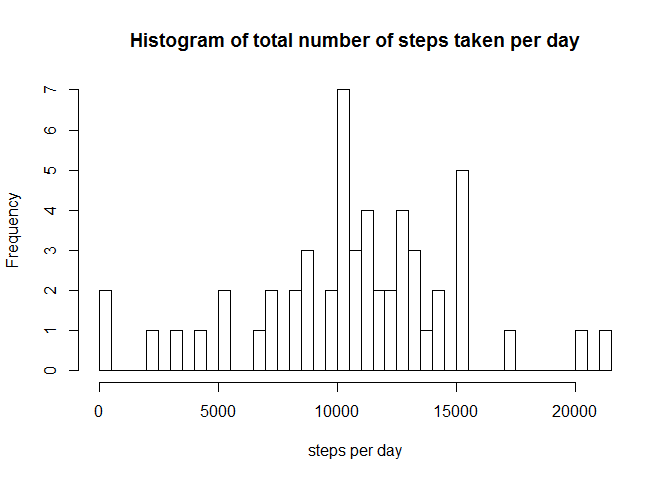
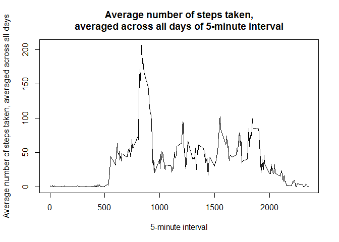
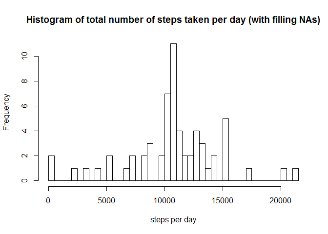
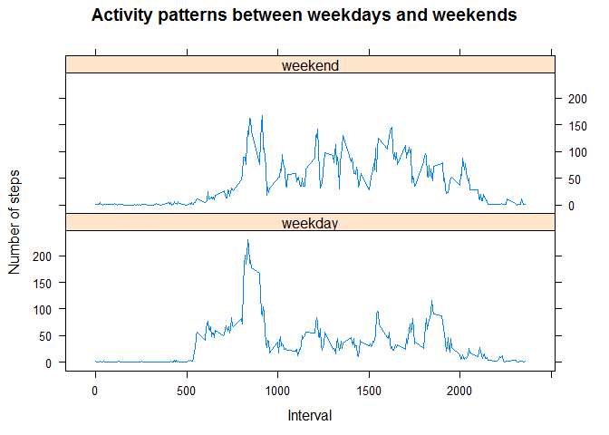

# Reproducible Research: Peer Assessment 1


## Loading and preprocessing the data

```r
act <- read.csv(unz("activity.zip","activity.csv") )
act$date <- as.Date(act$date)
```


## What is mean total number of steps taken per day?

```r
act_day <- aggregate( steps ~ date  , data = act ,FUN = "sum",na.rm= TRUE)
hist(act_day$steps,breaks = 50, main = "Histogram of total number of steps taken per day", 
     xlab = "steps per day")
```

<!-- -->

Mean of total number of steps is **10,766.19**.
Median of total number of steps is **10,765.00**. 

## What is the average daily activity pattern?

```r
act_interval <- aggregate( steps ~ interval  , data = act ,FUN = "mean")
plot(act_interval$interval, act_interval$steps,type = "l",
     xlab = "5-minute interval",ylab = "Average number of steps taken, averaged across all days", 
     main = "Average number of steps taken,\naveraged across all days of 5-minute interval")
```

<!-- -->

5-minute interval with maximun number of average step across all days is  **835**.

## Imputing missing values

Total number of rows with NAs is **2304**.  
Filling the missing value in dataset with ***mean of each 5-minute interval***by the code belows, because there are all NAs on some day.


```r
act_nafilled <- act

for(interval in unique(act_nafilled$interval)){
  act_nafilled[ is.na(act_nafilled[,1]) & act_nafilled[,3]==interval,1] <- 
    mean(act_nafilled[act_nafilled[,3]==interval,1],na.rm = TRUE)
}


act_nona_day <- aggregate( steps ~ date  , data = act_nafilled ,FUN = "sum")
hist(act_nona_day$steps,breaks = 50, main = "Histogram of total number of steps taken per day (with filling NAs)",xlab = "steps per day")
```

<!-- -->

Mean of total number of steps is **10,766.19**.
Median of total number of steps is **10,766.19**. 
From this filling strategy, imputing missing data impact on ***median value***. Median of total number of steps is adjusted to equal mean value.

## Are there differences in activity patterns between weekdays and weekends?

```r
act_nafilled$weekday <- "weekday"
act_nafilled[ weekdays(act_nafilled$date) %in% c("เสาร์","อาทิตย์"),]$weekday <- "weekend"
act_nafilled$weekday <- as.factor(act_nafilled$weekday)

act_nafilled_avg <- aggregate( steps ~ interval + weekday   , data = act_nafilled ,FUN = "mean",na.rm= TRUE)

library(lattice) 
xyplot(steps~interval|weekday, 
   data = act_nafilled_avg,
   layout = c(1,2),
   xlab="Interval", ylab="Number of steps",
   type="l",
   main="Activity patterns between weekdays and weekends") 
```

<!-- -->

Activity in weekends is lower than weekdays, except activity, around interval 800, is higher.
